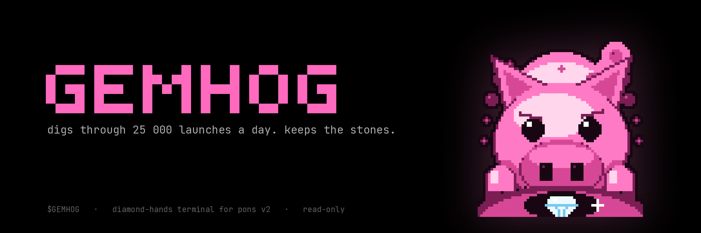
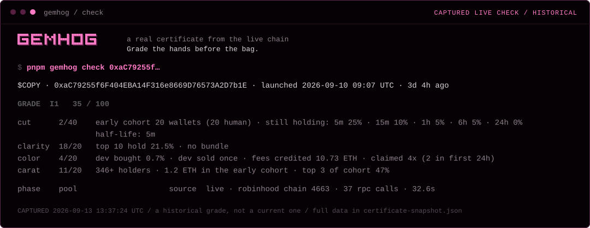
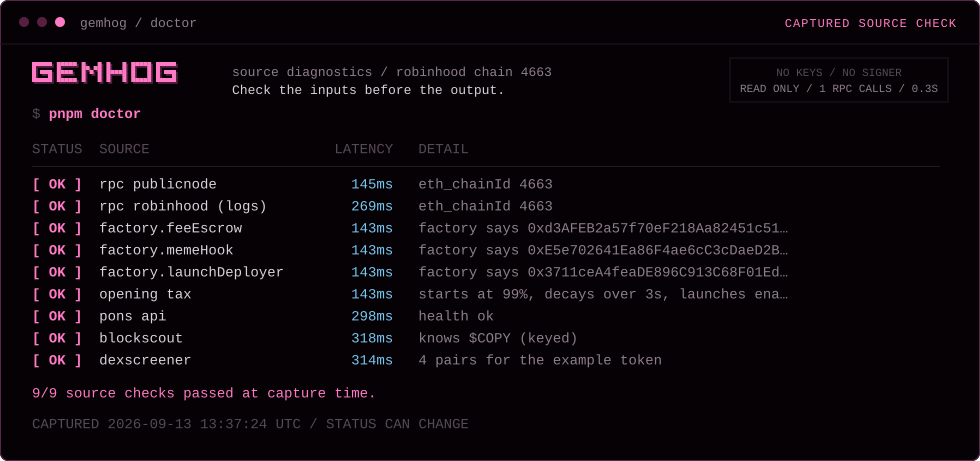
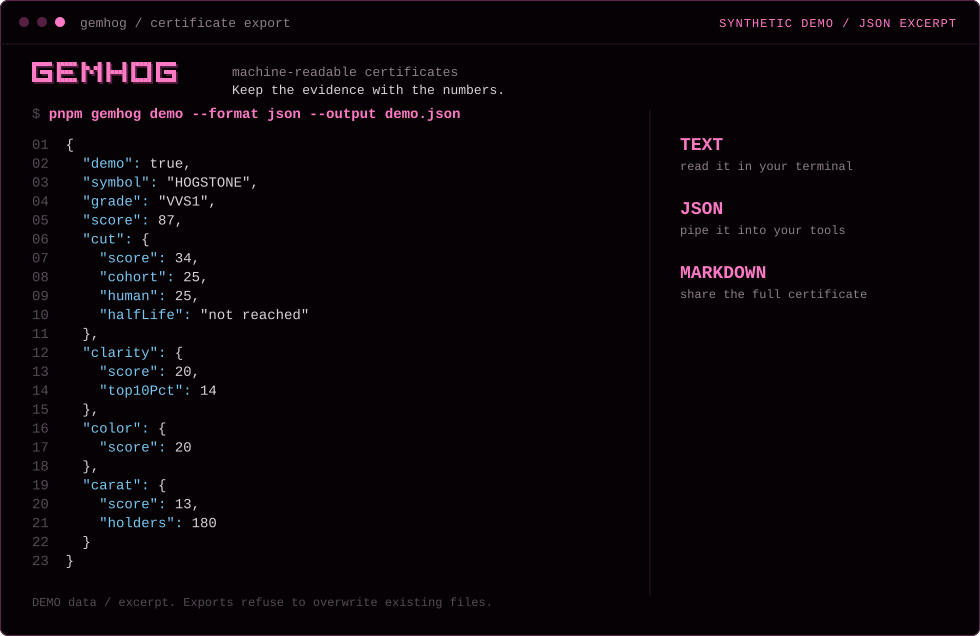
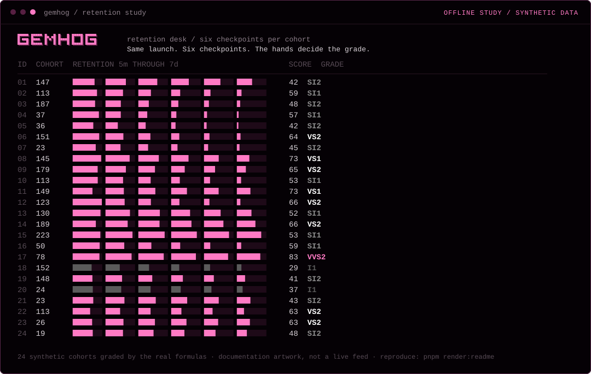
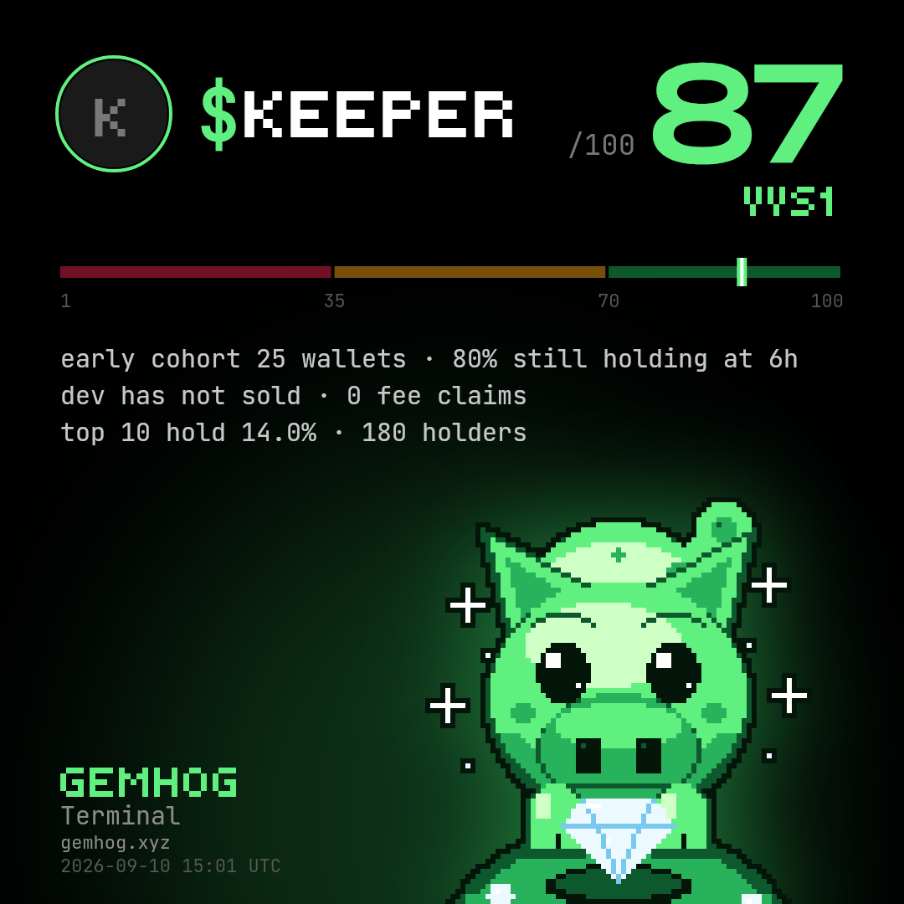
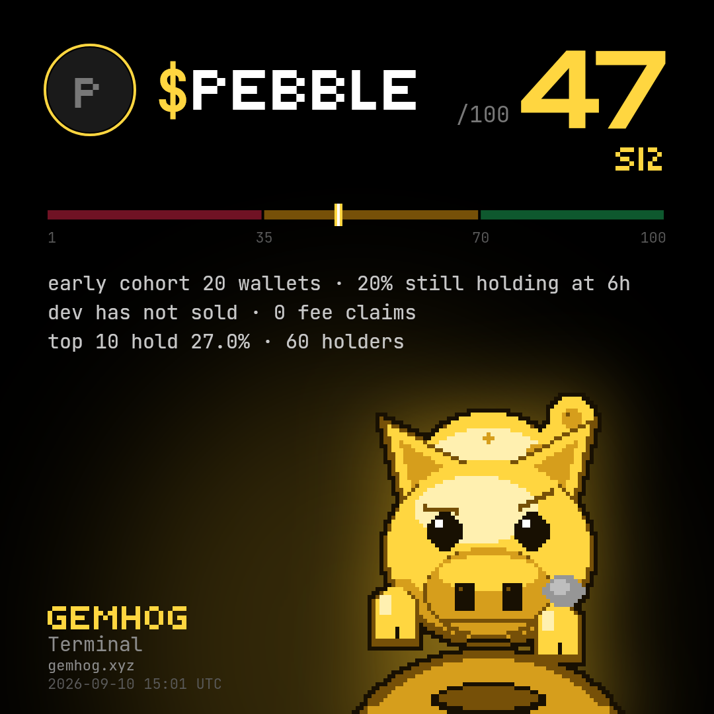
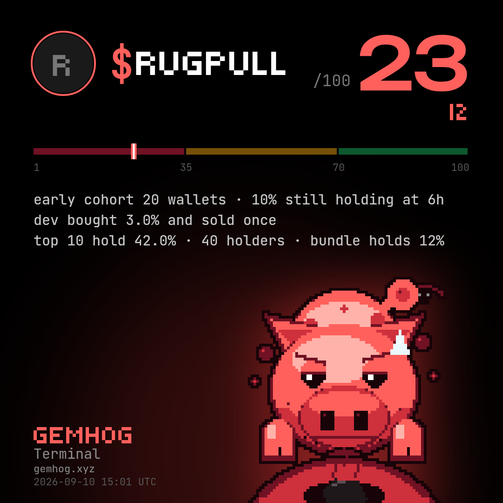
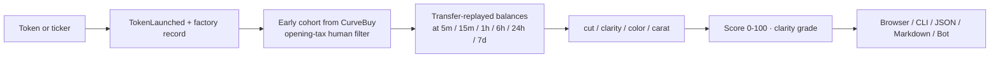

<p align="center"></p>
<p align="center"></p>

<p align="center">
  <a href="https://github.com/Skynet-inisghts/GEMHOG/actions/workflows/ci.yml"></a>
  
  
  
  
  <a href="LICENSE"></a>
</p>

<p align="center"><strong>Grade the hands before the bag.</strong><br/>A browser and local CLI for grading holder retention of Pons V2 tokens on Robinhood Chain.</p>
<p align="center"><a href="https://gemhog.xyz">Website</a> · <a href="https://gemhog.xyz/terminal">Terminal</a> · <a href="https://gemhog.xyz/holders">Holder Check</a> · <a href="https://gemhog.xyz/docs">Docs</a></p>
<p align="center"><a href="#start-in-one-minute">Start locally</a> · <a href="#holder-check">Holder Check</a> · <a href="#live-grading">Live grading</a> · <a href="docs/COMMANDS.md">Commands</a> · <a href="docs/METHODOLOGY.md">Methodology</a> · <a href="docs/ARCHITECTURE.md">Architecture</a></p>

## Why GEMHOG

A wallet shows you a price. It does not show you whether anyone intends to stay. 25,000 tokens launch on Pons every day, and the word "community" in a token description means nothing; the only community that can be measured is the buyers of the first minute, and the only question that matters is whether they are still holding.

GEMHOG takes a token, finds those first-minute buyers, and checks who is still in position at 5m, 15m, 1h, 6h, 24h and 7d. Retention, concentration, dev behaviour and weight fold into a score out of 100 and a grade on the diamond clarity scale, FL down to I3. The pig is the meme; the certificate is the product.

### Read the hands, not the post



A styled documentation view of an actual `check` result against the live chain. The capture time is printed inside the image; it is a historical grade, not a current one. [Full captured data →](assets/readme/certificate-snapshot.json)

## Available in the current source

| Surface | What works |
| --- | --- |
| Grade engine | Early cohort, six retention checkpoints, cut/clarity/color/carat, the full clarity scale |
| Local CLI | `check <token\|ticker>` live grading with cluster disambiguation; `doctor`; `demo` |
| Browser terminal | `/terminal`: ticker or CA in, certificate out, offline demo, share as image |
| API | `POST /api/grade` (same JSON as the CLI), `GET /api/health` |
| Holder Check | `/holders` and `gemhog holders`: every pons token in a public wallet, graded |
| hunt | The whole window graded, best-funded first, with `--follow`; lives only in the CLI |
| watch, top, export | Re-grade one token on a loop; the cached top 10; the last hunt as CSV/JSON |
| Pulse | `GET /api/top` and `/api/pulse`: grade counters, refreshed every 20 minutes, never the list |
| Telegram bot | `/check` `/top` `/watch` `/alerts` over `gemhog serve`; zero grading logic in the bot |
| Docs | `/docs` on the site renders the repository docs; the sources live in `docs/` |
| Offline walkthrough | Synthetic certificate, labelled DEMO on every line, no provider requests |
| Exports | JSON and Markdown for every command; exports refuse to overwrite existing files |
| Verification | Engine fixtures with hand-derived expected grades, CLI tests, Node 22/24 CI, `no-signer` job |

Official `$GEMHOG` contract: TBA. The address will be published here, on the site and in `lib/gemhog/project-token.ts` at launch; until then any address claiming to be $GEMHOG is not ours.

### Holder Check

Open `/holders` to request an account from an injected EVM wallet. The browser asks the wallet for exactly one thing, `eth_requestAccounts` — the public address. There is no signature, approval, network switch or transaction request, and the `no-signer` CI job greps the source on every commit to keep it that way. A pasted public address works identically, with no wallet at all.

The page lists every pons token the address holds with its balance and share of supply; the largest holdings grade automatically and the rest grade on demand, since each certificate replays that token's transfer history. **View example receipt** shows a visibly labelled synthetic walkthrough of the $GEMHOG holder receipt that activates at launch.

```bash
pnpm gemhog holders <PUBLIC_WALLET>
```

Wallet listings come from the Blockscout API, which requires a key: get **your own** free one at [dev.blockscout.com](https://dev.blockscout.com) (Get Started for Free, then create an API key) and put it in `.env` as `BLOCKSCOUT_API_KEY`. Keys are personal and rate-limited (~5 requests per second on the free plan) — gemhog spaces its Blockscout requests to stay under that, and never ships anyone's key in the repository. Grading itself never needs the key.

## Start in one minute

Install Node.js 20+ and pnpm, then:

```bash
git clone https://github.com/Skynet-inisghts/GEMHOG.git
cd GEMHOG
pnpm install --frozen-lockfile
pnpm demo
```

`demo` compiles the CLI and prints a reproducible, synthetic certificate. Every line of it is marked `DEMO`; it does not fetch live data.

### Check the sources



The doctor talks to both public RPC endpoints, re-reads the pons factory addresses from the live factory, and probes the Pons API, Blockscout and DexScreener. These are measured results from the capture time printed inside the image, not a continuous uptime monitor. [Captured checks →](assets/readme/doctor-snapshot.json)

```bash
pnpm doctor
```

A red line means grades cannot be trusted yet.

## Receipts that travel



The same certificate can be read in a terminal, consumed as JSON, or shared as Markdown. The picture shows an excerpt of the real demo schema.

```bash
pnpm gemhog demo --format json --output demo.json
pnpm gemhog demo --format markdown --output demo.md
```

Exports refuse to overwrite existing files.

Open the site locally:

```bash
pnpm dev
```

Visit `http://localhost:3000` for the landing page and `/terminal` for the browser terminal.

## Live grading

The example below is a supported public token, not the GEMHOG contract:

```bash
pnpm gemhog check 0xac79255f6f404eba14f316e8669d76573a2d7b1e
pnpm gemhog check PEANUT
pnpm gemhog check 0x… --format json --output certificate.json
```

The certificate near the top of this README shows a captured run of the first command. A ticker fans out to the search sources and every candidate is verified against the pons factory; an ambiguous ticker returns the whole cluster and asks for the contract address. Bonding-curve tokens that never graduated are searchable by ticker only with a free `BLOCKSCOUT_API_KEY` in `.env`; the contract address always works.

How the grade is computed — the cohort, the checkpoints and all four component formulas — is written down in [docs/METHODOLOGY.md](docs/METHODOLOGY.md).

### Same launch. Six checkpoints.



A static terminal-style study: 24 synthetic cohorts run through the real cut/clarity/color/carat formulas. It is documentation artwork built from the engine's math, not a live feed and not an additional CLI mode.

## The hunt lives only in the CLI

```bash
pnpm gemhog hunt --window 6h
pnpm gemhog hunt --window 6h --min-grade VS2 --follow
pnpm gemhog top
pnpm gemhog export --format csv --output stones.csv
pnpm gemhog watch 0x…
```

`hunt` indexes every launch in the window (thousands), reads three curve values per launch through multicall3, and spends its time budget grading the funded candidates, best-funded first. `--follow` keeps digging: it re-grades as checkpoints pass, prints tokens entering the top, and sends a Telegram alert at VS1 or better when `TELEGRAM_BOT_TOKEN` and `TELEGRAM_CHAT_ID` are set in `.env` — with both empty, nothing is ever posted anywhere.

The site never gets the list. `GET /api/top` and `GET /api/pulse` return counters and the grade distribution, refreshed every 20 minutes by the pulse workflow; the ranked table exists only in the CLI, on purpose.

## Share cards

<p align="center">
  
  
  
</p>

Every certificate renders a 1080x1080 share card: red for scores 1-35, yellow for 36-70, green for 71-100 — the pig's mood and the stone in its hoof match the zone. The three cards above are the recorded fixtures; the terminal shows the live card under every certificate, **Share as image** downloads it, and a shared `/terminal?token=…` link unfurls into the card on X and Telegram. The bot answers `/check` with the same card.

```bash
pnpm gemhog check 0x… --card card.png
```

Cards for tokens younger than 5 minutes do not exist (`/api/card` answers 425): there is no grade to show yet. The demo card carries a DEMO plate, like everything else synthetic.

## The bot

The Telegram bot is the third door into the same engine: `/check`, `/top`, `/watch` with 15-minute re-grades, and `/alerts` fed by `hunt --follow`. It contains zero grading logic — every answer comes from `gemhog serve`, a local JSON API bound to 127.0.0.1. `docker-compose.yml` runs the pair; [docs/BOT.md](docs/BOT.md) has the full contract. English, no emoji, except one diamond before VVS2 and better.

## How it works



The cohort is the set of unique buy recipients in the first 60 seconds (a quiet launch widens to the first 20 buyers). The opening tax splits bots from humans: ~99% of a buy burned means a bot raced the block, near zero means a wallet waited. Balances at every checkpoint are replayed from Transfer history — the public RPC is not archival — and a wallet counts as holding while it keeps at least 80% of its peak.

Retention, concentration, dev behaviour and weight fold into the four components. Formulas, sources and limits: [docs/METHODOLOGY.md](docs/METHODOLOGY.md).

## Project map

```text
bin/gemhog.mjs           CLI: check, hunt, watch, top, holders, serve, demo, doctor, export
lib/gemhog/
  chain.ts               chain definition, verified pons addresses, multicall3
  rpc.ts                 the gate: bounded concurrency, 429 backoff, endpoint penalty box
  read/                  launches, logs, holders, wallet, blocks - everything that touches the network
  grade/                 cohort, checkpoints, components, grade - pure functions, fixture-tested
  resolve.ts             ticker to launch cluster, factory-verified
  certificate.ts         one renderer for every surface
  hunt.ts / serve.ts     the flagship scan; the bot's local API
app/                     Next.js: landing, terminal, holders, docs, api/grade|holder|top|pulse|health
bot/                     Python, aiogram 3; zero grading logic
assets/                  the art pack and readme/ - SVG views rendered from real command output
docs/                    methodology, commands, architecture, testing, bot, launch kit
test/                    fixtures with hand-derived grades; engine, CLI and serve tests
.github/workflows/       ci.yml (typecheck, tests, bot tests, no-signer) - pulse.yml (20-minute counters)
```

## API and development

`POST /api/grade` accepts `{ "token": "0x…" }` or `{ "ticker": "PEANUT" }` and returns the same certificate JSON as the CLI, `{ "cluster": [...] }` for an ambiguous ticker, or `{ "error": "…" }`. `POST /api/holder` accepts only a public `{ "wallet": "0x…" }` and lists its pons tokens. `GET /api/top?window=6h` and `GET /api/pulse` return counters and the grade distribution — never the list. `GET /api/health` runs the doctor's checks. Server routes hold a 60-second in-memory cache per input so a page full of browsers cannot hammer the public RPC.

```bash
pnpm check
```

See [testing](docs/TESTING.md), [contributing](CONTRIBUTING.md), [changelog](CHANGELOG.md), and [security](SECURITY.md).

The terminal images are documentation illustrations of existing outputs, rendered by `scripts/render-readme.mjs` from real command runs, never drawn by hand. [Reproduce or refresh the images →](assets/readme/README.md)

## Boundaries and sources

GEMHOG holds no keys and has no transaction path. Holder Check will request only a public EVM address. A grade is a measurement of past holder behaviour, not a prediction and not a proof that a token is safe.

Built against public [Pons Portal data](https://www.ponsportal.fun/docs.html), [Pons V2 contracts](https://github.com/ponsdotdev/ponsfamily/tree/main/contractsV2), [Robinhood Chain](https://docs.robinhood.com/chain/), [Blockscout](https://robinhoodchain.blockscout.com) and [DexScreener](https://docs.dexscreener.com/api/reference). Independent of these services. Chain-reading code adapted from [bodkin](https://github.com/Phosphenq/bodkin) and [novamp](https://github.com/bored2boar/novamp) (MIT). MIT — see [LICENSE](LICENSE).
